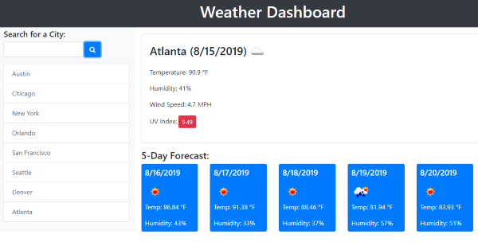
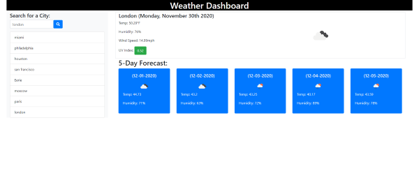

# Weather Dashboard

This is the completed sixth weekly challenge for the UPENN LPS Coding Bootcamp.<br><br>
This project required us to build a weather dashboard using [openweathermap.org](https://openweathermap.org/).<br>
According to the grading rubric the scheduler had to meet the following requirements:<br>

```
GIVEN a weather dashboard with form inputs
WHEN I search for a city
THEN I am presented with current and future conditions for that city and that city is added to the search history
WHEN I view current weather conditions for that city
THEN I am presented with the city name, the date, an icon representation of weather conditions, the temperature, the humidity, the wind speed, and the UV index
WHEN I view the UV index
THEN I am presented with a color that indicates whether the conditions are favorable, moderate, or severe
WHEN I view future weather conditions for that city
THEN I am presented with a 5-day forecast that displays the date, an icon representation of weather conditions, the temperature, and the humidity
WHEN I click on a city in the search history
THEN I am again presented with current and future conditions for that city
```

<br>

## **Link**

Here is a link to the [deployed application](https://gintstir.github.io/weather-api/)<br> 

Here is a link to the [github repository](https://github.com/Gintstir/weather-api)<br>


## **Screenshots**  
The mock up we were to use as a guide:

>


The deployed site:

>
<br>

## **Motivation**


- Learning to retrieve and display data from a third-part API.
- Gaining a better understanding of vanilla JS syntax and structure.
- Using localStorage
- Learning about and implementing:
    - DOM manipulation
    - Using Third Party APIs to style and improve UI<br>  

## **Build Status**

This Work Day Scheduler should be considered complete.    

## **Code Style**

This project was built from the ground up using:
- CSS
- HTML
- JavaScript
- jQuery
- <a href="https://getbootstrap.com/" target="_blank">Bootstrap</a>
- <a href="https://momentjs.com/" target="_blank">Moment.js</a>
- <a href="https://fontawesome.com/" target="_blank">FontAwesome</a>
- <a href="https://openweathermap.org/" target="_blank">Openweathermap API</a>

## **Credits**

Thanks to UPennLPS Coding Bootcamp. Thank you to the bootcamp instructors and TA's for all their help along the way ❤.  